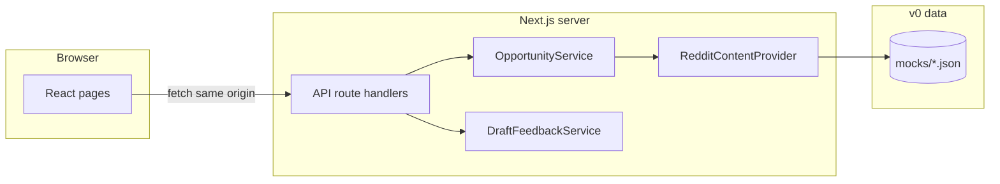

# Architecture

## High-level picture

Discussion Companion deploys as one **Next.js** app. The browser loads App Router pages. JSON over HTTP is handled by **route handlers** in `src/app/api/**/route.ts`. Business logic stays on the server unless you deliberately expose it.

Another `RedditContentProvider` implementation can replace `JsonDatasetRedditProvider` without changing the HTTP contracts the UI relies on.

## Layers

| Piece | Location | Role |
| --- | --- | --- |
| Pages and layout | `src/app/` | User-facing UI (landing today). |
| API | `src/app/api/` | Parse HTTP, call services, return JSON. |
| Domain logic | `src/lib/services/` | Ranking, draft feedback, Reddit-shaped reads. |
| Types | `src/lib/types/` | Shared DTOs and response envelopes. |
| Shared utilities | `src/lib/config/`, `src/lib/utils/`, `src/lib/constants/` | Env, logging, defaults. |
| Bundled data | `mocks/` | JSON consumed by `JsonDatasetRedditProvider` in v0. |

## Runtime and deployment

- **Local:** `npm run dev` on port 3000 by default.
- **Production:** `npm run build` then `npm run start`, or a compatible host (for example Vercel).

## Configuration and secrets

Never commit real credentials. Use `.env.local` (gitignored) with keys from `.env.example` when you connect live Reddit or other services. Server-only env vars are not sent to the browser unless your handler includes them in a response.
